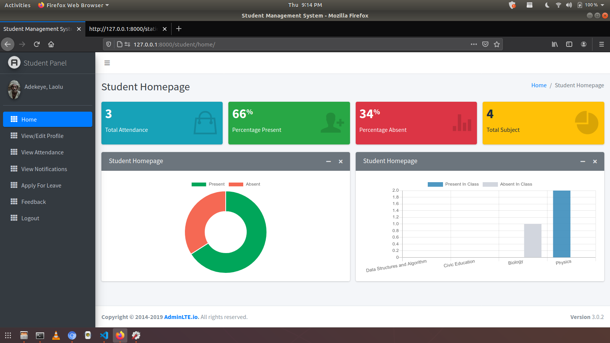
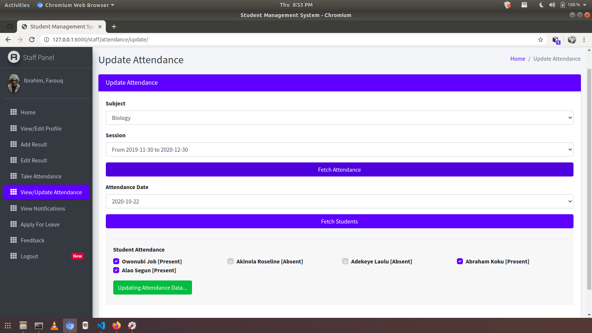
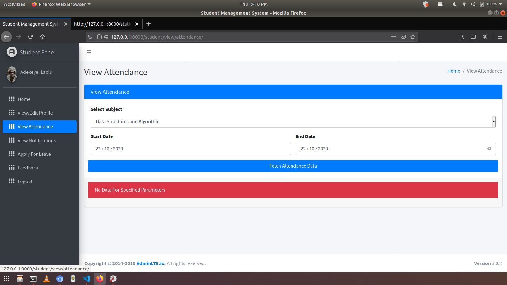

# 📚 Student Management System Using Django

This is a simple and intuitive Student Management System developed using Django. It serves as a comprehensive solution for managing student data and is highly customizable to meet the needs of educational institutions. 

Feel free to clone this project, explore it, and make changes based on your requirements. If you find this project helpful, please consider giving it a star ⭐️!


## 🌐 Deployed Version
The project is deployed and can be accessed here: [Student Management System on Heroku](https://smswithdjango.herokuapp.com/)

## 🎥 Project Demo
Watch the [Project Demo on YouTube](https://www.youtube.com/watch?v=kArCR96m7uo) to see the system in action.

## 💼 Features

### A. Admin Users Can:
1. View overall summary charts of student performance, staff performance, courses, subjects, leave, etc.
2. Manage Staff (Add, Update, and Delete).
3. Manage Students (Add, Update, and Delete).
4. Manage Courses (Add, Update, and Delete).
5. Manage Subjects (Add, Update, and Delete).
6. Manage Sessions (Add, Update, and Delete).
7. View Student Attendance.
8. Review and reply to Student/Staff Feedback.
9. Review (Approve/Reject) Student/Staff Leave requests.

### B. Staff/Teachers Can:
1. View summary charts related to their students, subjects, leave status, etc.
2. Take/Update Student Attendance.
3. Add/Update Student Results.
4. Apply for Leave.
5. Send Feedback to the Head of Department (HOD).

### C. Students Can:
1. View summary charts related to their attendance, subjects, leave status, etc.
2. View Attendance Records.
3. View Results.
4. Apply for Leave.
5. Send Feedback to the HOD.

## 📸 Screenshots
| Admin Interface | Staff Interface | Student Interface |
|-----------------|----------------|-------------------|
||||
||||
||||
||||
||||
||||

## 🛠️ Installation and Setup

### Prerequisites:
1. Install Git: [Download here](https://git-scm.com/)
2. Install Python: [Download here](https://www.python.org/downloads/)
3. Install Pip (Python Package Manager): [Installation Guide](https://pip.pypa.io/en/stable/installing/)

### Step-by-Step Installation:

1. **Create a Folder** where you want to save the project.
2. **Create a Virtual Environment** and Activate it:

   Install Virtual Environment:
   ```bash
   pip install virtualenv
   ```

   Create Virtual Environment:
   - **Windows**: `python -m venv venv`
   - **Mac**: `python3 -m venv venv`
   - **Linux**: `virtualenv .`

   Activate Virtual Environment:
   - **Windows**: `source venv/scripts/activate`
   - **Mac**: `source venv/bin/activate`
   - **Linux**: `source bin/activate`

3. **Clone this project:**
   ```bash
   git clone https://github.com/jobic10/student-management-using-django.git
   cd student-management-using-django
   ```

4. **Install Requirements from `requirements.txt`:**
   ```bash
   pip install -r requirements.txt
   ```

5. **Configure Allowed Hosts:**
   Open `settings.py` and configure `ALLOWED_HOSTS`:
   ```python
   ALLOWED_HOSTS = ['*']
   ```

6. **Run Server:**
   - **PC**: `python manage.py runserver`
   - **Mac/Linux**: `python3 manage.py runserver`

7. **Create Super User:**
   ```bash
   python manage.py createsuperuser
   ```

   Alternatively, you can use default credentials:
   - **Admin (HOD)**: Email: admin@admin.com | Password: admin
   - **Staff**: Email: staff@staff.com | Password: staff
   - **Student**: Email: student@student.com | Password: student

## 🖼️ Front-end Template
The front-end uses [Admin LTE](http://adminlte.io) template for a clean and modern UI.

## 🤝 Contributing
Feel free to contribute to this project by opening issues or sending pull requests. To support, please add a star 🌟 to this repository.

## 📜 License
This project is licensed under the MIT License. See the LICENSE file for more details.

---

This version of the README is now more streamlined, focusing on the project's key features and setup instructions.
